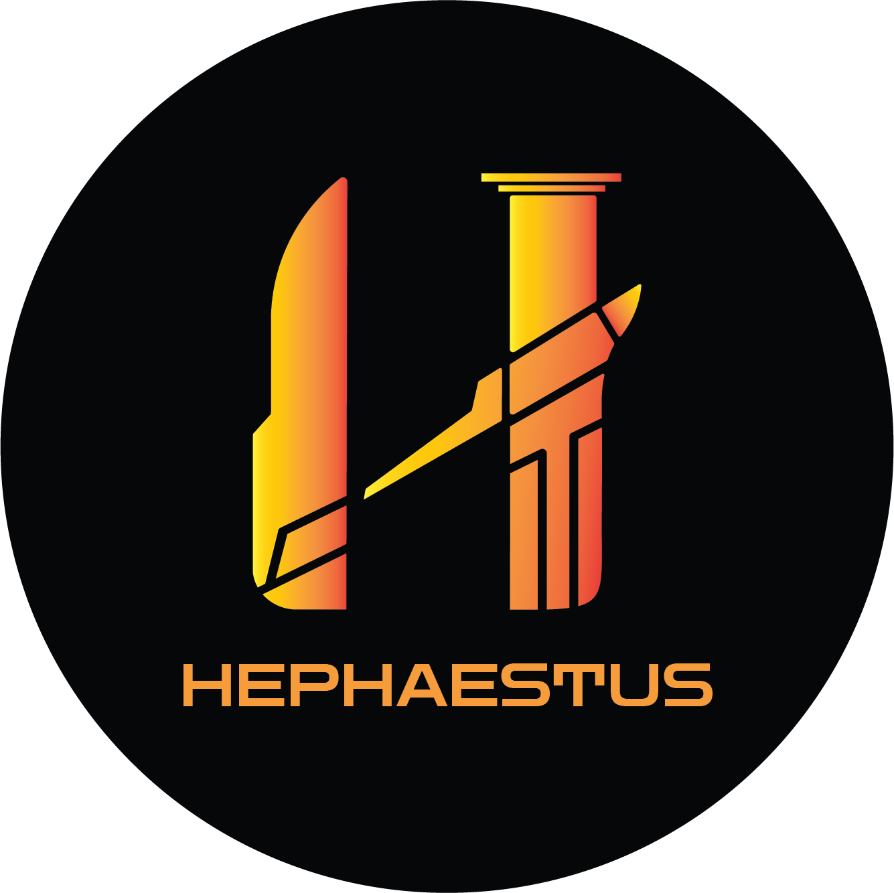

<div align="center">
  
  
  # 🔥 Hephaestus Team Website
  
  **University Robotics & Automation Team** 🤖⚡
  
  *Innovating the future through technology and collaboration* ✨
  
  [](https://nextjs.org/)
  [](https://reactjs.org/)
  [](https://www.typescriptlang.org/)
  [](https://tailwindcss.com/)
  
</div>

---

## 🌟 About This Project

This is the official website for the **Hephaestus Team** - a passionate university robotics and automation team dedicated to creating innovative projects that participate in national and international competitions! 🏆

Our modern, responsive website showcases our team members, projects, and achievements while providing an engaging user experience with:
- 🎨 Beautiful dark/light theme support
- 📱 Fully responsive design
- 🚀 Interactive rocket scroll indicator
- ⚡ Lightning-fast performance
- 🎯 Modern UI/UX design

## 🔧 Technologies Used

### Frontend Framework
- **Next.js 15.5.2** - React framework with App Router 🚀
- **React 19.1.0** - Latest React with concurrent features ⚛️
- **TypeScript 5.0** - Type-safe development 📝

### Styling & UI
- **Tailwind CSS 4.0** - Utility-first CSS framework 🎨
- **Heroicons** - Beautiful hand-crafted SVG icons 🎯
- **Custom animations** - Smooth transitions and effects ✨

### Development Tools
- **Turbopack** - Ultra-fast bundler for development ⚡
- **PostCSS** - CSS processing and optimization 🔄
- **ESLint & Prettier** - Code quality and formatting 📏

## 🏛️ About Hephaestus Team

**Hephaestus Team** is a dynamic university robotics and automation team focused on cutting-edge technology and innovation. Our main goal is the creation of modern projects that participate in national and international competitions! 🌍

### 🔬 Our Areas of Expertise

#### 🌤️ Weather Stations
Design and development of advanced weather stations providing accurate, real-time environmental data with sensors for temperature, humidity, air pressure, wind speed, and precipitation.

#### 🏙️ Smart Cities & Houses
Creating intelligent urban solutions for better transportation, water supply, lighting, waste management, and energy systems. Building more interactive and responsive city administration with safer public spaces.

#### 🌱 Smart Greenhouses
Revolutionizing agriculture through IoT sensors and monitoring systems that create self-regulating microclimates, optimizing production conditions and automating agricultural processes.

#### 🏢 Building & Large-Scale Automation
Focusing on maintenance and control of tunnels, hydraulic cleaning, dams, and designing smart campuses using AI and sensors for comprehensive automation solutions.

### 🎯 Our Mission
To bridge the gap between theoretical knowledge and practical applications, pushing the boundaries of technology through collaborative learning and innovative research.

## 🚀 Getting Started

### Prerequisites
- Node.js 18+ 📦
- npm, yarn, pnpm, or bun 🛠️

### Installation

1. **Clone the repository**
   ```bash
   git clone https://github.com/your-username/hephaestus_gr.git
   cd hephaestus_gr
   ```

2. **Install dependencies**
   ```bash
   npm install
   # or
   yarn install
   # or
   pnpm install
   ```

3. **Run the development server**
   ```bash
   npm run dev
   # or
   yarn dev
   # or
   pnpm dev
   # or
   bun dev
   ```

4. **Open your browser**
   Navigate to [http://localhost:3000](http://localhost:3000) to see the website! 🌐

## 📁 Project Structure

```
hephaestus_gr/
├── app/                    # Next.js App Router
│   ├── components/         # Reusable React components
│   ├── team/              # Team page
│   ├── projects/          # Projects showcase
│   ├── contact/           # Contact information
│   └── cv/[id]/          # Individual CV pages
├── public/                # Static assets
│   ├── logo.png          # Team logo
│   ├── heph-cute.png     # Team mascot
│   └── data/             # JSON data files
└── ...
```

## 🎨 Features

- ✨ **Modern Design** - Clean, professional interface
- 🌙 **Dark/Light Mode** - Automatic theme switching
- 📱 **Responsive Layout** - Works on all devices
- 🚀 **Interactive Elements** - Engaging user experience
- ⚡ **Fast Performance** - Optimized for speed
- 🔍 **SEO Optimized** - Better search visibility
- 🎯 **Accessibility** - WCAG compliant design

## 🤝 Contributing

We welcome contributions from the community! Feel free to:
- 🐛 Report bugs
- 💡 Suggest new features
- 🔧 Submit pull requests
- 📖 Improve documentation

## 📞 Contact

- 🌐 **Website**: [https://www.hepheastus.gr/](https://www.hepheastus.gr/)
- 📧 **Email**: Contact us through our website
- 🏛️ **University**: Robotics & Automation Department

## 📄 License

This project is developed by the Hephaestus Team for educational and competition purposes.

---

<div align="center">
  
  **Made with ❤️ by the Hephaestus Team** 🔥
  
  *Forging the future of robotics and automation* ⚒️🤖
  
</div>
